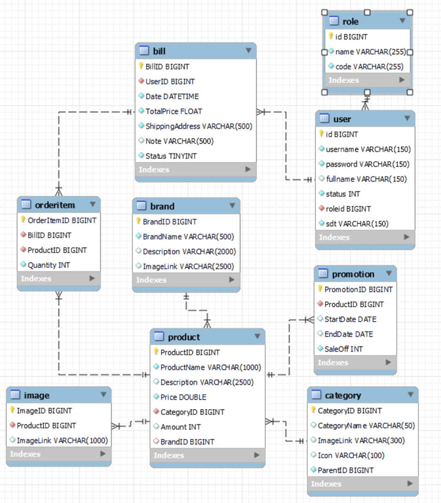

# lapTrinhWebNhom6

## Thực thể (bảng):

user: Lưu trữ thông tin người dùng (khách hàng) với các thuộc tính như username, password, fullname, status, roleid, sdt.  
role: Xác định vai trò của người dùng (ví dụ: admin, khách hàng, nhân viên) với các thuộc tính name và code.  
category: Lưu trữ thông tin về danh mục sản phẩm với CategoryName, ImageLink, Icon, và ParentID (cho danh mục con).  
brand: Lưu trữ thông tin về thương hiệu sản phẩm với BrandName, Description, và ImageLink.  
product: Chứa thông tin chi tiết về sản phẩm bao gồm ProductName, Description, Price, Amount, CategoryID, và BrandID.  
image: Lưu trữ đường dẫn hình ảnh của sản phẩm (ImageLink) và liên kết với sản phẩm thông qua ProductID.  
bill: Lưu trữ thông tin về hóa đơn bao gồm UserID, Date, TotalPrice, ShippingAddress, Note, và Status.  
orderitem: Chi tiết các sản phẩm trong một hóa đơn với BillID, ProductID, và Quantity.  
promotion: Thông tin về các chương trình khuyến mãi bao gồm ProductID, StartDate, EndDate, và SaleOff.  

##Mối quan hệ:
user - role: Mối quan hệ một-nhiều (one-to-many), một người dùng có thể có một vai trò.
category - category: Mối quan hệ một-nhiều (one-to-many) thể hiện danh mục cha và danh mục con.
product - category: Mối quan hệ nhiều-một (many-to-one), một sản phẩm thuộc về một danh mục.
product - brand: Mối quan hệ nhiều-một (many-to-one), một sản phẩm thuộc về một thương hiệu.
image - product: Mối quan hệ nhiều-một (many-to-one), một sản phẩm có thể có nhiều hình ảnh.
bill - user: Mối quan hệ nhiều-một (many-to-one), một người dùng có thể có nhiều hóa đơn.
orderitem - bill: Mối quan hệ nhiều-một (many-to-one), một hóa đơn có thể có nhiều sản phẩm.
orderitem - product: Mối quan hệ nhiều-một (many-to-one), một sản phẩm có thể xuất hiện trong nhiều hóa đơn.
promotion - product: Mối quan hệ nhiều-một (many-to-one), một sản phẩm có thể có nhiều chương trình khuyến mãi.
